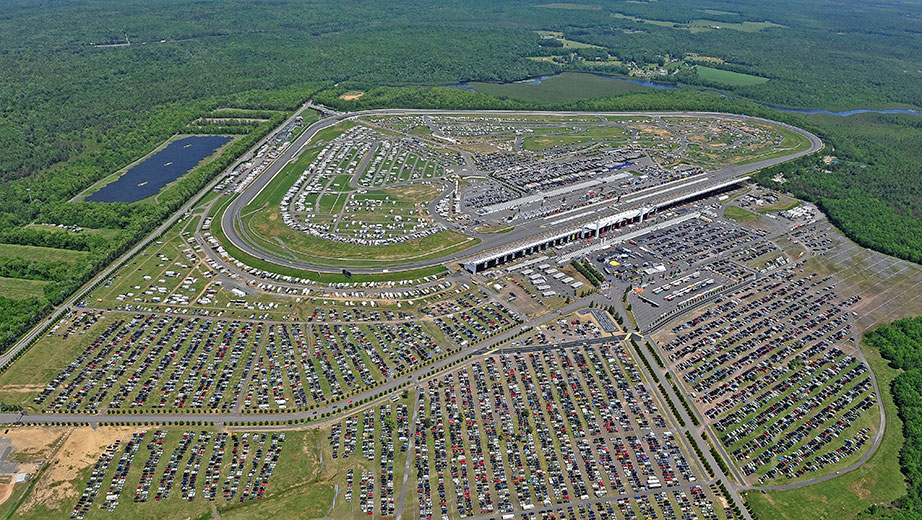

<style>

body {
  padding-top:0px
}

.navbar{
  visibility: hidden
}

</style>

```{r setup, include=FALSE}
require("flexdashboard")
require("RPostgreSQL")
require("plotly")
require("DT")

pw <- {""}
drv <- dbDriver("PostgreSQL")
con <- dbConnect(drv, dbname = "gnascar",
                 host = "localhost", port = 5432,
                 user = "mgaither", password = pw)

# query the data from postgreSQL 
season2018 <- dbGetQuery(con, "SELECT * from season_2018")
roster2018 <- dbGetQuery(con, "SELECT * from roster_2018")

# 2018 Roster Standings
xform <- list(categoryorder = "array",
              categoryarray = c("Baby Got Track", "Gator Dad", "Don't Beat My Johnson", "Killer B's", "Up Front", "Hollywood High Life", "Chasing Cletus", "J-Town Throw Down", "Ricky Bobby", "Field", "Redneck Ghoster"))

seasonstandings2018 <- merge(season2018, roster2018,by=c("Driver"))

seasonstandings2018 <- seasonstandings2018[c("Driver", "Team", "Points","Diff","Ppts","Races","Win","T5","T10","Pole","Laps","Led","AvSt","AvFn","RAF","Miles","LLF")]
seasonstandings2018 <- seasonstandings2018[order(-seasonstandings2018$Points),]

driversumm2018 <- seasonstandings2018[,c("Driver", "Team", "Points", "Diff", "Ppts", "Win")]
rownames(driversumm2018) <- NULL

teampoints2018 <- aggregate(data=seasonstandings2018,Points~Team,sum) 
teampoints2018 <- teampoints2018[order(-teampoints2018$Points),] 
rownames(teampoints2018) <- NULL

f1 <- list(
  family = "Arial, sans-serif",
  size = 18,
  color = "lightgrey"
)
f2 <- list(
  family = "Old Standard TT, serif",
  size = 12,
  color = "black"
)
a <- list(
  title = "",
  titlefont = f1,
  showticklabels = TRUE,
  tickangle = 45,
  tickfont = f2
)

a <- list(
  x = seasonstandings2018$Owner,
                  y = 100,
                  text = aggregate(data=seasonstandings2018,Points~Team,sum) ,
                  xref = "x",
                  yref = "y",
                  showarrow = TRUE,
                  arrowhead = 4,
                  arrowsize = .5,
                  ax = 20,
                  ay = -40)

p_team <- plot_ly(seasonstandings2018, x = ~Team, y = ~Points, type = 'bar', text=~Driver, 
              color = ~Team, colors = "Pastel1", 
              textposition = 'auto', marker = list(line = list(color = 'gray36', width = 1))) %>% 
    layout(yaxis = list(title = 'Points', dtick = 100), xaxis = list(title = ' '), barmode = 'stack') %>%
  layout(xaxis = xform)

p_driver <- plot_ly(seasonstandings2018, x = ~Points, y = ~AvSt, type = 'scatter', mode = 'markers',
  marker = list(line = list(color = 'rgba(152, 0, 0, .8)', width = 2)),
  hoverinfo = 'text',
  text = ~paste('Driver: ', Driver, '</br>',
                '</br>Team: ', Team,
                '</br>Points: ', Points,
                '</br>Wins: ', Win,
                '</br>Poles: ', Pole,
                '</br>Average Start: ', AvSt, 
                '</br>Average Finish:', AvFn),
  color = ~Team, colors = "Paired", size = ~Win) %>%
  layout(title = "",
         xaxis = list(title = "Points", zeroline = FALSE),
         yaxis = list (title = "Average Starting Position", zeroline = FALSE),
         plot_bgcolor = 'rgba(245, 246, 249, 1)')

```
### 2018 Season

<div class="section no-pad-bot" id="index-banner">
<div class="container">
<h1 class="header center">Next Stop: Pocono</h1>
<div class="row center">
<div class="card">
<div class="card-image">

</div>
<div class="card-content"
<h5 class="header col s12 light">"Pocono 400 on June 3 @1400 PM ET on FS1"</h5>
</div>  
</div>
</div>
<br>
</div>
</div>

### Individual Driver Points

```{r}
datatable(driversumm2018, class = 'cell-border stripe', options = list(pageLength = -1, dom = 't'))
#datatable(driversumm2018, class = 'cell-border stripe', options = list(autoWidth = TRUE, pageLength = -1, dom = 't', columnDefs = list(list(width = '50px', targets = "_all"))))
```

### Team Points

```{r}
datatable(teampoints2018, class = 'cell-border stripe', options = list(pageLength = -1, dom = 't'))
#datatable(teampoints2018, class = 'cell-border stripe', options = list(autoWidth = TRUE, pageLength = -1, dom = 't', columnDefs = list(list(width = '50px', targets = "_all"))))
```

### Stacked Bar of Driver Points by Team

```{r}
htmltools::tagList(list(p_team))
```

### Complete Driver Statistics

```{r}
rownames(seasonstandings2018) <- NULL
datatable(seasonstandings2018, class = 'cell-border stripe', options = list(pageLength = -1, dom = 't'))
```

### Driver Points v. Average Starting Position

```{r}
htmltools::tagList(list(p_driver))
```

